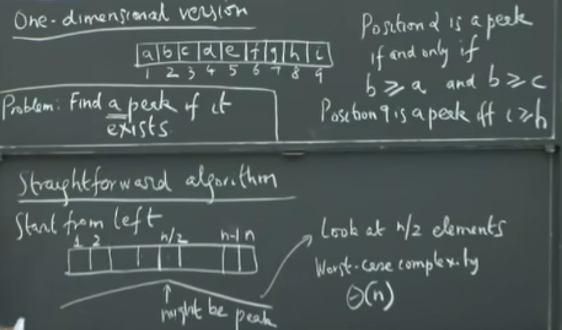
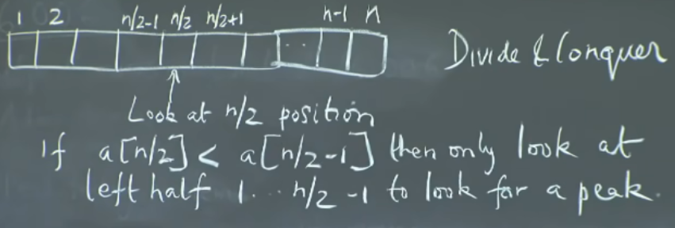
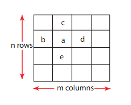
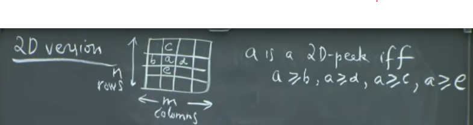
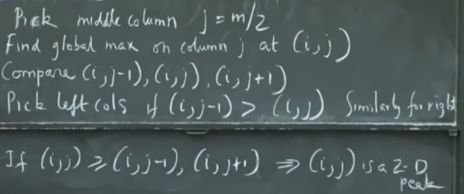
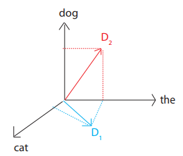

# Lecture 1

## Peak finder problem
-----

A value is considered a peak, if it is larger than its *immediate* neighbours.

### 1-Dimensional version  

* 9 different positions : [1,2,3,4,5,6,7,8,9] <=> [a,b,c,d,e,f,g,h,i]
* Value at `array[i]` is a peak **iff** `array[i] >= array[i-1] and array[i[] >= array[i+1]`:
* A peak **always exists** as the definition uses *`>=`*
* Given - a to i are numbers, position 2 is a peak if and only if (b >= a and b>= c)  
* Problem - find peak if it exists  

* **Algorithm** -  
    <strong/>a. Naive approach: Start from left</strong>
    * If peak is somewhere in the middle, look at n/2 elements. Worst-case complexity -> Θ(n). 
    * Theta because it gives lower and upper bound. Big-o only upper bound  

    <strong>b. Binary search approach: Look at n/2th position</strong>
    * Look at *n/2* position
    * If `array[n/2] > array[n/2 -1]`:
        * Look at **left half** `1...n/2 --- 1` to look for peak
    * Else if `array[n/2] < array[n/2 +1]`:
        * Look at **right half** `n/2 +1 ... n` to look for peak
    * Else `array[n/2]` is a peak:
        * `array[n/2] >= array[n/2-1]`
        * `array[n/2] >= array[n/2+1]`

    * **Time complexity** -
        * T(n) = work algorithm does on input size *n*.
        * Comparing `array[n/2]` to neighbours = &Theta;(1)
        * Base Case :
            * **T(1) = &Theta;(1)**
            * One element array -> return element as peak.  
        * *T(n) = T(n/2) + &Theta;(1)* *= &Theta;(1) + ... &Theta;(1)(log<sub>2</sub>(n)times)* ***= &Theta;(log<sub>2</sub>(n))***

    *   

    *   

### 2-Dimensional version

<p align = "center"> </p>

* Given - *a* is a peak **iff**: * *a >= b, a >= c, a >= d, a >= e*
* Problem - find peak if it exists  
* **Algorithm** -

    <strong>a. Greedy ascent algorithm: Picks a direction and tries to find a direction following that peak</strong>
    * Makes choices on where to start
    * If next_ele in same direction > current: continue exploring
    * Else: check for all the neighbors and if they are smaller, we have arrived at a peak

    **Time complexity:** T(N) = Θ(n &middot; m)

    <strong>b. Divide and conquer algorithm: Binary search coupled in 2-D version</strong>

    1. Pick middle column *j = m/2*
    2. Find *global maximum* on column *j* at *(i, j)*
        * Linear search for maximum element
    3. Compare *(i, j-1), (i,j), (i, j+1)*
    4. Pick columns to continue with:
        * Left half if *(i, j-1) > (i, j)*
        * Right half if *(i, j+1) > (i, j)*
    5. *(i, j)* is a 2D peak if **neither** condition from step 4 holds.
    * *(i, j)* is known to be maximum in *j* direction
    * If neither *(i, j-1) or (i, j+1)* are > than *(i, j)* then it must **also be a peak** in the *i* direction -> 2D peak.
    6. Solve new problem with 1/2 number of columns
    * When a single column left, find global maximum -> done.

    **Time complexity**  
    *  *T(n) = T(n, m/2) + &Theta;(n)*
        * Base Case : **T(n,1) = &Theta;(n)**
        * *T(n, m) = &Theta;(n) + &Theta;(n) + ... log<sub>2</sub>(m)times* ***= &Theta;(n * log<sub>2</sub>(m))***

* 

*   

# Lecture 2

## Models of Computation

* "al-khwarizmi" - base root word from where algorithm is derived
* Algorithm?  
    a. Computational procedure for solving a problem  
    b. Mathematical analog of a computer program 
* What operations an algorithm is allowed and Cost of each operation => specified by models of computation

* Algorithm is mathematical analog of a program

### Random Access Machine
* Random Access Memory (RAM) modeled by a large array:

```
 +---+
0|   |
 +---+
1|   |
 +---+
2|   |
 +---+
3|   | <-- word
 +---+
```

* **word** = *w* bits
    * *w* >= log(size of memory) -> should be able to specify an index into the RAM array
* **O(1)** time to: 
    * Load O(1) words
    * Do O(1) computations
    * Store O(1) words
* O(1) registers

### Pointer Machine
More abstract, simpler way of thinking about computation - very simple model of OOP
* Dynamically allocated objects
* Object has O(1) **fields**
* **Field** = a word (i.e int) or a **pointer** to and object or null (or None)

### Python Model
* arrays = "lists"
* object oriented programming with O(1) attributes - pointer machine model
* l.append(x) - table doubling with O(1) time
* l = l1 + l2 - (constant time)
* l.sort() - O(l log l)
* Dictionary - O(1)
* and many more in lecture notes..

## Document distance problem 
------

Given two documents *d1*, *d2* compute the **distance** between them.
* Distance = how **different** the documents are
* Document = sequence of words
* Word = string of alphanumeric chars

### Look at shared words/chars
* Represent document as a **vector**
    * D1 = "the cat", D2 = "the dog":
    * 

* D[w] = # occurrences of w in D
* Use measure of commanlity:
    * d`(D1 &middot; D2) = Σw (D1[i] &middot; D2[i]) where i = {w1, w2, w3, ..., wn} => [not scale invariant]
* Use **angle between the vectors**:
    * arccos(D1&middot;D2 / |D1||D2|)
        * Dot products divided by lengths of documents to make more scale invariant

#### Algorithm
1. Split document into words
    * word = sequence of consectutive alphanumeric characters (punctuation acts
    like a space)
    * Case insensitive
2. Compute word frequencies (vectors for each document)
3. Compute angle between vectors:
    * d(x,y) = arccos(inner_product(x,y) / (norm(x)*norm(y)))
        * where:
            * inner_product(x,y) = x1*y1 + x2*y2 + ... xn*yn
            * norm(x) = sqrt(inner_product(x,x))

#### Implementation

1. Read file by lines:
    * Change punctuation to spaces
    * Lowercase
    * Split
2. Add each word in line to python `collections.Counter`
3. Repeat for second file
4. Inner Product:
    * iterate over key:val pairs, if key in both vectors, multiple vals together and add to total.
5. Calculate angle using inner product
